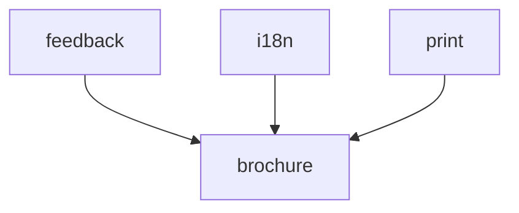

# System map

Generated 2026-05-12 by regen-map. Do not hand-edit.

## Modules

| Module | Purpose | Status |
|--------|---------|--------|
| [brochure](../../src/brochure/MODULE.md) | Defines the HTML structure and section-slot contract for all 12 static content sections of the Arangetram brochure webpage. | [DRAFT] |
| [feedback](../../src/feedback/MODULE.md) | Provides the audience feedback feature — a form collecting visitor name and feedback text, persistence to Google Sheets via a Google Apps Script Web App, and a clickable name list rendered on page load and refreshed after each submission. | [DRAFT] |
| [i18n](../../src/i18n/MODULE.md) | Manages the English/Tamil language toggle. | [DRAFT] |
| [print](../../src/print/MODULE.md) | Provides print-to-PDF capability via a `@media print` CSS layer that hides all interactive elements, controls page breaks across brochure sections, and preserves content layout. | [DRAFT] |

## Dependency graph



## Project File Structure

_Alphabetical, regenerated by regen-map. Directory descriptions come from MODULE.md Purpose; file descriptions come from the per-language description-source rule in structure-conventions.md._

```
utils/
├── DISK_CLEANER_SUMMARY.md
├── README_DISK_CLEANER.md
├── disk_cleaner/
│   ├── __init__.py
│   ├── __main__.py
│   ├── categorize.py
│   ├── check.py
│   ├── cleanup.py
│   ├── cli.py
│   ├── db.py
│   ├── export.py
│   ├── finalize.py
│   └── scan.py
├── docs/
│   └── compact/
│       ├── DECISIONS.md
│       ├── MAP.md
│       ├── PROJECT.md
│       ├── STATUS.md
│       ├── phases/
│       │   ├── architecture.md
│       │   ├── development.md
│       │   └── requirements.md
│       ├── project-init-interview.md
│       ├── requirements.md
│       └── structure-conventions.md
├── git-sync/
│   ├── adopt-github-rewrite.sh
│   ├── config.sh
│   ├── git-debug.sh
│   ├── setup-personal.sh
│   ├── setup-work.sh
│   ├── sync-personal.sh
│   └── sync-work.sh
├── ollama-offline/
│   ├── Download-OllamaModel.ps1
│   ├── OLLAMA-OFFLINE-INSTALL.md
│   ├── Test-DownloadOllamaModel.ps1
│   ├── install-ollama-model.sh
│   └── test-install-ollama-model.sh
├── pyproject.toml
├── skills/
│   └── compact/
│       ├── COMPACT_Cheatsheet.html
│       ├── COMPACT_Cheatsheet.png
│       ├── COMPACT_Cheatsheet.svg
│       ├── COMPACT_Overview.md
│       ├── README.md
│       ├── close-session/
│       │   └── SKILL.md
│       ├── compact/
│       │   └── SKILL.md
│       ├── doctor/
│       │   └── SKILL.md
│       ├── drift-check/
│       │   └── SKILL.md
│       ├── install.ps1
│       ├── install.sh
│       ├── project-init/
│       │   ├── SKILL.md
│       │   ├── base-prompts/
│       │   │   ├── 00-swdev-project-customizer.md
│       │   │   ├── 01-swdev-requirement-gathering.md
│       │   │   ├── 02-swdev-architecture-design.md
│       │   │   └── 03-swdev-development-testing-debugging.md
│       │   └── templates/
│       │       ├── DECISIONS.md
│       │       ├── MAP.md
│       │       ├── PROJECT.md
│       │       ├── STATUS.md
│       │       ├── requirements.md
│       │       └── structure-conventions.md
│       ├── regen-map/
│       │   └── SKILL.md
│       ├── session-start/
│       │   └── SKILL.md
│       └── switch-phase/
│           └── SKILL.md
├── src/
│   ├── brochure/  # Defines the HTML structure and section-slot contract for all 12 static content sections of the Arangetram brochure webpage.
│   │   └── MODULE.md
│   ├── feedback/  # Provides the audience feedback feature — a form collecting visitor name and feedback text, persistence to Google Sheets via a Google Apps Script Web App, and a clickable name list rendered on page load and refreshed after each submission.
│   │   └── MODULE.md
│   ├── i18n/      # Manages the English/Tamil language toggle.
│   │   └── MODULE.md
│   └── print/     # Provides print-to-PDF capability via a @media print CSS layer that hides all interactive elements, controls page breaks across brochure sections, and preserves content layout.
│       └── MODULE.md
└── tests/
    ├── __init__.py
    ├── test_categorize.py
    ├── test_check.py
    ├── test_cleanup.py
    ├── test_export.py
    ├── test_finalize.py
    └── test_scan.py
```
