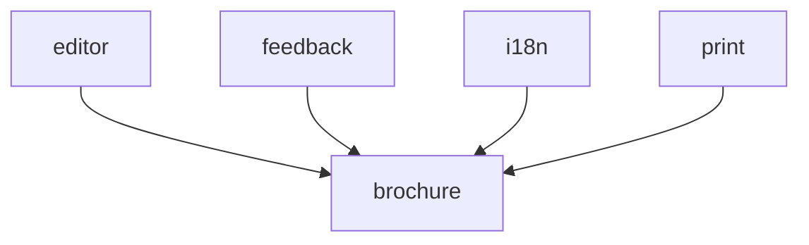

# System map

Generated 2026-05-12 by regen-map. Do not hand-edit.

## Modules

| Module | Purpose | Status |
|--------|---------|--------|
| [brochure](../../src/brochure/MODULE.md) | Defines the HTML structure and section-slot contract for all 12 static content sections of the Arangetram brochure webpage. | [DRAFT] |
| [editor](../../src/editor/MODULE.md) | Provides a local-only visual authoring interface for the brochure, allowing the owner to edit text content, swap images, reorder sections, add content cards within existing sections, and adjust design tokens without editing source files manually. | [DRAFT] |
| [feedback](../../src/feedback/MODULE.md) | Provides the audience feedback feature — a form collecting visitor name and feedback text, persistence to Google Sheets via a Google Apps Script Web App, and a clickable name list rendered on page load and refreshed after each submission. | [DRAFT] |
| [i18n](../../src/i18n/MODULE.md) | Manages the English/Tamil language toggle. | [DRAFT] |
| [print](../../src/print/MODULE.md) | Provides print-to-PDF capability via a `@media print` CSS layer that hides all interactive elements, controls page breaks across brochure sections, and preserves content layout. | [DRAFT] |

## Dependency graph



## Project File Structure

_Alphabetical, regenerated by regen-map. Directory descriptions come from MODULE.md Purpose; file descriptions come from the per-language description-source rule in structure-conventions.md._

```
utils/
├── css/
│   └── style.css              # CSS custom properties; breakpoints: mobile ≤480px | tablet 481–1024px | desktop >1024px
├── docs/
│   └── compact/
│       ├── DECISIONS.md
│       ├── MAP.md
│       ├── PROJECT.md
│       ├── STATUS.md
│       ├── phases/
│       │   ├── architecture.md
│       │   ├── development.md
│       │   └── requirements.md
│       ├── project-init-interview.md
│       ├── requirements.md
│       └── structure-conventions.md
├── index.html
└── src/
    ├── brochure/  # Defines the HTML structure and section-slot contract for all 12 static content sections of the Arangetram brochure webpage.
    │   └── MODULE.md
    ├── editor/    # Provides a local-only visual authoring interface for the brochure, allowing the owner to edit text content, swap images, reorder sections, add content cards within existing sections, and adjust design tokens without editing source files manually.
    │   └── MODULE.md
    ├── feedback/  # Provides the audience feedback feature — a form collecting visitor name and feedback text, persistence to Google Sheets via a Google Apps Script Web App, and a clickable name list rendered on page load and refreshed after each submission.
    │   └── MODULE.md
    ├── i18n/      # Manages the English/Tamil language toggle.
    │   └── MODULE.md
    └── print/     # Provides print-to-PDF capability via a @media print CSS layer that hides all interactive elements, controls page breaks across brochure sections, and preserves content layout.
        └── MODULE.md
```
